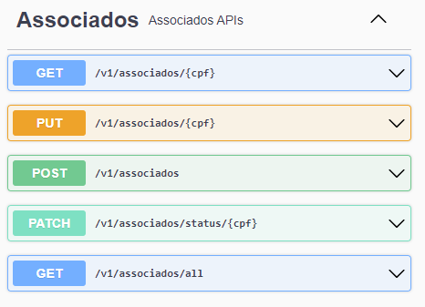
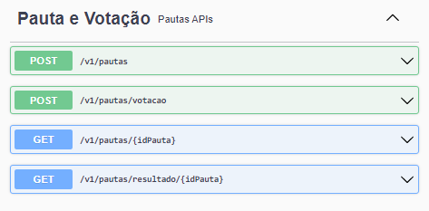
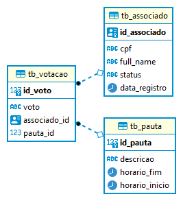

## Api de Gestão de Pautas

### ✔️ Técnicas e tecnologias utilizadas

- ``Java 17``
- ``Spring Boot 3.0.6``
- ``Maven 3.9.1``
- ``JPA``
- ``Lombok``
- ``PostgreSQL``
- ``InteliJ IDEA``
- ``Swagger springdoc 2.0.3``
- ``Postman - para teste da APi local``
- ``Git - para versionamento``
- ``GitHub``
- ``Deploy Railway - https://railway.app/ licença de teste com horas limitadas,``
- ``o deploy vai ficar ativo até 19-05 às 14h``

### Ajustes e melhorias

Validação de votos em assembleias:

|Associado | Pauta        |
| --- | --- |
| Cadastro | Cadastro     |
| Lista Todos | Votacao      |
| Atualiza Status  | Pauta por Id |
| Busca por CPF  | Resultado    |

 
  | | |

### ER Diagrama BD


### Pull Request Feito
https://github.com/ranelho/act/pull/1

### Swagger Local
http://localhost:8080/act/api/public/swagger-ui/index.html
### Swagger em Deploy
https://act-production.up.railway.app/act/api/public/swagger-ui/index.html

Em deploy até 26-05

### Clone Projeto
```
git remote add origin https://github.com/ranelho/act.git
```
## Trechos de código
### application.yml 

```
# profile via variável de ambiente -> ex: para banco em produção SPRING_PROFILES_ACTIVE = prod,
# para banco de teste SPRING_PROFILES_ACTIVE = dev

spring:
  profiles:
    active: ${SPRING_PROFILES_ACTIVE}
server:
  servlet:
    context-path: /act/api

#configuração swagger
springdoc:
  swagger-ui:
    path: /public/swagger
```

### application-prod.yml
```
# Configuração para deploy em produção
# DB_HOST_PROD url para o banco ex: jdbc:postgresql://localhost:5432/act
# DB_USERNAME_PROD usuario do banco
# DB_PASSWORD_PROD senha do banco

spring:
  datasource:
    driverClassName: org.postgresql.Driver
    url: ${DB_HOST_PROD}
    username: ${DB_USERNAME_PROD}
    password: ${DB_PASSWORD_PROD}
  jpa:
    generate-ddl: true
    properties:
      hibernate:
        ddl-auto: update
        show_sql: true
        format_sql: true
```
### application-dev.yml

```
#Configuração para acesso ao banco de dados de testes local

spring:
  datasource:
    driverClassName: org.postgresql.Driver
    url: jdbc:postgresql://localhost:5432/act
    username: #usuario local
    password: #senha local
  jpa:
    generate-ddl: true
    properties:
      hibernate:
        ddl-auto: update
        show_sql: true
        format_sql: true
```

### Validações
```
// 400 - Bad Request
{    
    "message": "Horário de votação ainda não começou"   
}
{    
    "cpf": "CPF inválido"                               
}

// 404 - Not Found
{    
    "message": "Pauta não encontrada!"                  
}
{
    "cpf": "deve corresponder a \"(^\\d{3}\\x2E\\d{3}\\x2E\\d{3}\\x2D\\d{2}$)\""
}
// 200 OK -> {{baseUrl}}/v1/pautas/resultado/254
{
    "votosSim": 0,
    "votosNao": 2,
    "vencedor": "NAO"
}
```
[⬆ Voltar ao topo](https://github.com/ranelho/act)<br>