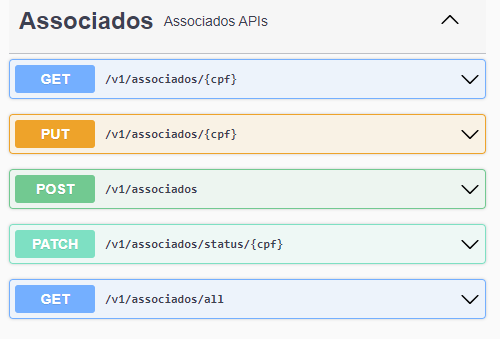

## Api de Gestão de Pautas

### ✔️ Técnicas e tecnologias utilizadas

- ``Java 17``
- ``Spring Boot 3.0.6``
- ``Maven 3.9.1``
- ``JPA``
- ``Lombok``
- ``PostgreSQL``
- ``InteliJ IDEA``
- ``Swagger springdoc 2.0.3``
- ``Postman - para teste da APi local``
- ``Git - para versionamento``
- ``GitHub``

### Ajustes e melhorias

Validação de votos em assembléias:

|Associado | Pauta        |
| --- | --- |
| Cadastro | Cadastro     |
| Lista Todos | Votacao      |
| Atualiza Status  | Pauta por Id |
| Busca por CPF  | Resultado    |


  
  | | |


## Banco de Dados
<br><sub>Banco de Dados</sub>

## Trechos de código

### Swagger Local
http://localhost:8080/act/api/public/swagger-ui/index.html

### Clone Projeto
```
git remote add origin https://github.com/ranelho/act.git
```
### application.yml 
profile via variável de ambiente -> ex: para banco em produção SPRING_PROFILES_ACTIVE = prod,
para banco de teste SPRING_PROFILES_ACTIVE = dev

```
spring:
  profiles:
    active: ${SPRING_PROFILES_ACTIVE}
server:
  servlet:
    context-path: /act/api

#configuração swagger
springdoc:
  swagger-ui:
    path: /public/swagger
```

### application-prod.yml
```
spring:
datasource:
  driverClassName: org.postgresql.Driver
  url: jdbc:postgresql://${DB_HOST_PROD}:${DB_PORT_PROD}/${DB_NAME_PROD}
  username: ${DB_USERNAME_PROD}
  password: ${DB_PASSWORD_PROD}
jpa:
  generate-ddl: true
  properties:
    hibernate:
      ddl-auto: update
      show_sql: true
      format_sql: true
```
### application-dev.yml

```
spring:
  datasource:
    driverClassName: org.postgresql.Driver
    url: jdbc:postgresql://act.postgres.uhserver.com:5432/act
    username: rltiact
    password: Dev@8524*
  jpa:
    generate-ddl: true
    properties:
      hibernate:
        ddl-auto: update
        show_sql: true
        format_sql: true
```

### Validações
```

// 400 - Bad Request
{    
    "message": "Horário de votação ainda não começou"   
}
{    
    "cpf": "CPF inválido"                               
}

// 404 - Not Found
{    
    "message": "Pauta não encontrada!"                  
}
{
    "cpf": "deve corresponder a \"(^\\d{3}\\x2E\\d{3}\\x2E\\d{3}\\x2D\\d{2}$)\""
}
// 200 OK -> {{baseUrl}}/v1/pautas/resultado/254
{
    "votosSim": 0,
    "votosNao": 2,
    "vencedor": "NAO"
}
```
# Autor

| [<br><sub>Ranelho Lacerda</sub>](https://github.com/ranelho) |
|:---------------------------------------------------------------------------------------------:|

[⬆ Voltar ao topo](https://github.com/ranelho/act)<br>